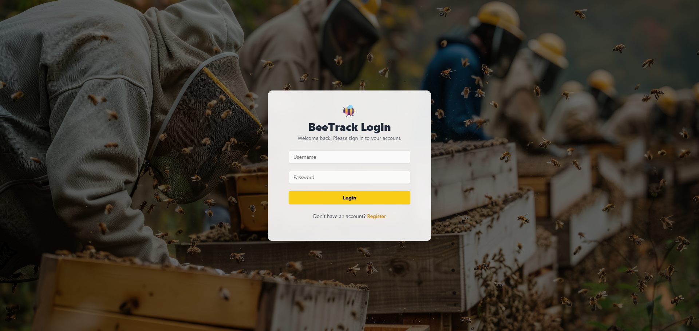
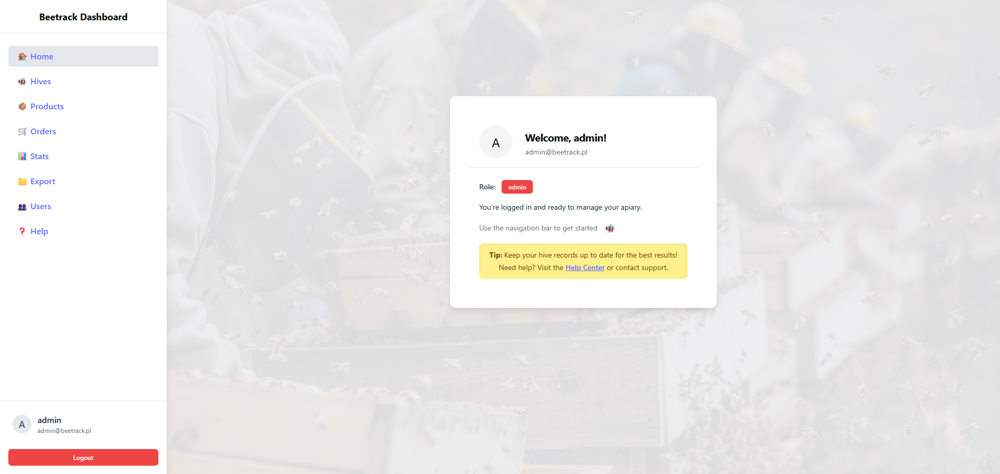
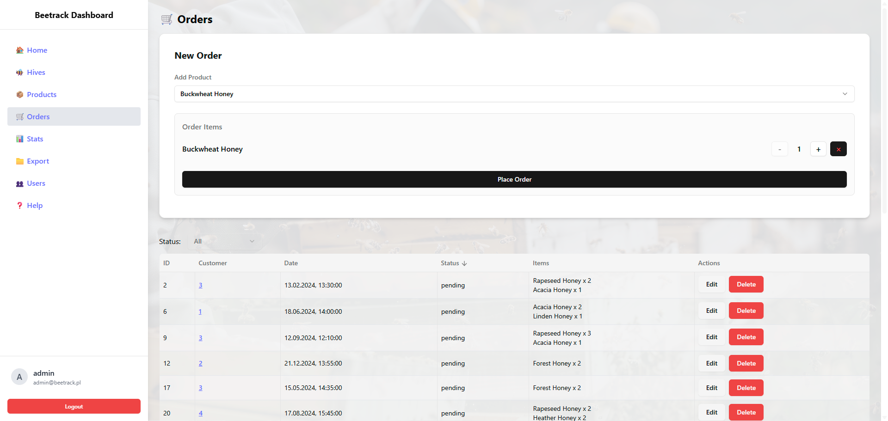
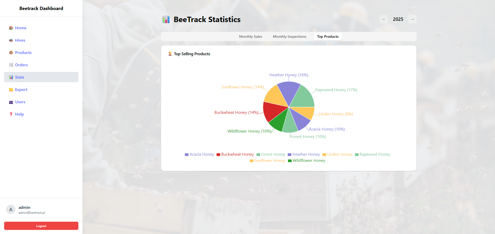

# 🐝 BeeTrack – Apiary Management System

BeeTrack is a full-featured backend & frontend system for managing an apiary business: hives, inspections, product inventory, orders, user roles, and automated background tasks.

Built for real-world use with FastAPI, PostgreSQL, Docker, cron jobs, Alembic, and JWT-based authentication - now with a modern React + Tailwind CSS frontend.

---

## ✨ Features

-   🔐 **User roles** – admin & worker access control
-   🐝 **Hive management** – location, status, inspections
-   🧪 **Inspections** – temperature, disease, notes
-   📦 **Products & orders** – M:N order-product relation
-   📊 **Stats & reports** – monthly sales, top products
-   � **Admin logging system** – comprehensive audit trails with filtering and search
-   🌍 **Timezone-aware** – UTC backend storage with local timezone display
-   �🗓️ **Scheduler** – cron-based log archival every 7 days
-   📁 **Export** – CSV and PDF (orders, inspections)
-   🔄 **Seed data** – admin, users, hives, products etc.
-   ☁️ **Dockerized** – production-ready deployment
-   🧬 **Alembic** – schema versioning via migrations
-   🚦 **Rate limiting (SlowAPI)** – protects API endpoints from abuse

---

## 🖼️ UI Screenshots

### 🔐 Login



### 📋 Dashboard (admin)



### 📦 Orders view



### 📊 Stats and Reports



---

## 🧰 Tech Stack

| Layer      | Tools                         |
| ---------- | ----------------------------- |
| Language   | Python 3.11                   |
| Framework  | FastAPI                       |
| ORM        | SQLAlchemy                    |
| Auth       | JWT (OAuth2) + bcrypt         |
| DB         | PostgreSQL                    |
| Cron       | APScheduler                   |
| Exports    | pandas, reportlab             |
| Migrations | Alembic                       |
| Frontend   | React, Vite, Tailwind, shadcn |
| Container  | Docker, docker-compose        |

---

## 🚀 Getting Started (Development)

### 1. Clone repo and enter project:

```bash
git clone https://github.com/zrdt80/beetrack.git
cd beetrack
```

### 2. Environment files

Create two `.env` files:

#### `.env`

```env
DATABASE_URL=postgresql+psycopg2://beetadmin:securepassword123@db:5432/beetrack
SECRET_KEY=changeme
```

#### `.env.db`

```env
POSTGRES_DB=beetrack
POSTGRES_USER=beetadmin
POSTGRES_PASSWORD=securepassword123
```

### 3. Build and run containers

```bash
docker-compose up --build
```

### 4. Access the API and frontend:

-   API Docs: [http://localhost:8000/docs](http://localhost:8000/docs)
-   Frontend: [http://localhost:3000](http://localhost:3000)

---

## 🔐 Test Users

| Role   | Username   | Email               | Password  |
| ------ | ---------- | ------------------- | --------- |
| admin  | admin      | admin@beetrack.net  | admin123  |
| worker | worker     | worker@beetrack.net | worker123 |
| worker | john_doe   | john@beetrack.net   | john123   |
| worker | jane_smith | jane@beetrack.net   | jane123   |

---

## 📊 Stats & Reports

| Endpoint                                       | Description                                     |
| ---------------------------------------------- | ----------------------------------------------- |
| `/stats/first-year`                            | Returns the year of the earliest recorded order |
| `/stats/monthly-sales?year=2025&month=7`       | Number of orders and total sales for a month    |
| `/stats/monthly-inspections?year=2025&month=7` | Number of inspections conducted in a month      |
| `/stats/yearly-top-products?year=2025&limit=5` | Top-selling products in a specific year         |
| `/stats/top-products?limit=5`                  | Top-selling products overall                    |
| `/export/orders/csv`                           | Download all order data as CSV                  |
| `/export/inspections/pdf`                      | Export inspection summaries as a PDF            |

---

## 📝 Admin Logging System

BeeTrack includes a comprehensive logging system for audit trails and system monitoring:

### 🔍 Features

-   **Admin-only access** – secure log management restricted to admin users
-   **Comprehensive tracking** – logs all user actions across the system
-   **Advanced filtering** – search by event type, date range, and keywords
-   **Statistics dashboard** – visual overview of system activity
-   **Bulk operations** – clear all logs or delete individual entries
-   **Timezone-aware** – UTC storage with automatic local timezone conversion

### 📊 Log Categories

-   🔐 **Authentication** – login attempts, token validation
-   👥 **User Management** – user creation, updates, role changes
-   🐝 **Hive Operations** – hive creation, updates, inspections
-   📦 **Order Processing** – order creation, updates, status changes
-   🍯 **Product Management** – inventory updates, product changes
-   📊 **Statistics** – report generation and data exports

### 🌐 API Endpoints

| Endpoint      | Method | Description                            |
| ------------- | ------ | -------------------------------------- |
| `/logs/`      | GET    | Retrieve all system logs (admin only)  |
| `/logs/clear` | DELETE | Clear all logs (admin only)            |
| `/logs/{id}`  | DELETE | Delete specific log entry (admin only) |

### ⏰ Timezone Handling

-   **Backend**: All timestamps stored in UTC for consistency
-   **Frontend**: Automatic conversion to user's local timezone
-   **Docker**: Containers configured with UTC timezone (`TZ=UTC`)
-   **Display**: Smart formatting with relative time ("2 hours ago") and full timestamps

---

## 📁 Seeded Data

### 👥 Users

-   **Admin role:** admin
-   **Worker role:** worker, john_doe, jane_smith

_All users have default passwords based on their username (e.g., `admin123`, `worker123`)._

---

### 🍯 Products

Eight types of honey with different characteristics and unit prices:

-   Linden, Buckwheat, Rapeseed, Forest
-   Acacia, Heather, Sunflower, Wildflower

Each product includes a name, description, unit price, and stock quantity.

---

### 🐝 Hives

Four hives located across different apiaries (North, South, East, West), each with:

-   current status (`active` or `inactive`)
-   last inspection date

---

### 🔍 Inspections

A set of 8 detailed inspections, varying by:

-   date and temperature
-   detected diseases (`none`, `varroa`, `nosema`)
-   inspection notes

All inspections are linked to specific hives via `hive_id`.

---

### 🧾 Orders

20 orders including:

-   user, date, total price
-   order status (`pending`, `completed`, `cancelled`)
-   detailed items (product, quantity, unit price)

This dataset allows you to:

-   test many-to-many relationships
-   generate real-world sales statistics
-   verify export functionality (CSV/PDF)

---

## 🐳 Docker Notes

### 🧱 Backend (FastAPI)

-   `entrypoint.sh` runs:

    1. Alembic migrations
    2. Seed data if the database is empty
    3. Uvicorn server (`uvicorn app.main:app`)

-   `logs/` and `exports/` directories are mounted into the container and excluded from the Docker image via `.dockerignore`.

-   Backend is available by default at: `http://localhost:8000`

---

### 🧑‍💻 Frontend (React + Vite)

-   The frontend is built and served by **Nginx** in a separate container.
-   Default URL: `http://localhost:3000`
-   React Router-based routing is handled by `nginx.conf` using `try_files $uri /index.html`.
-   The environment variable `VITE_API_URL` should point to the backend address, e.g., `http://localhost:8000`.

---

### 🧪 Running the full environment

```bash
docker-compose up --build -d
```

After launch:

-   Frontend: [http://localhost:3000](http://localhost:3000)
-   Backend docs: [http://localhost:8000/docs](http://localhost:8000/docs)

---

### ⚠️ Notes

-   The frontend container depends on the backend (`depends_on: api`), but make sure that `VITE_API_URL` points to the correct backend address during build.
-   In production, it's recommended to expose both services via a reverse proxy (e.g., Traefik, Nginx, Caddy) or unify them under a single domain.

---

## 📌 Roadmap

-   [x] REST API with role-based access
-   [x] Order-inspection-product relations
-   [x] Cron + background tasks
-   [x] Export PDF & CSV
-   [x] React frontend with Tailwind + dashboard
-   [x] Soft delete + user management
-   [x] Rate limiting for key endpoints
-   [x] Comprehensive admin logging system
-   [x] Timezone-aware datetime handling
-   [x] Advanced log filtering and statistics
-   [ ] Admin CLI commands
-   [ ] Unit tests (pytest + vitest)
-   [ ] Deploy to Render/Fly.io
-   [ ] Notifications (email, logs)

---

## 📄 License

MIT – use freely for learning, commercial, or non-commercial projects.

---

**Made with 🍵 and Python**
