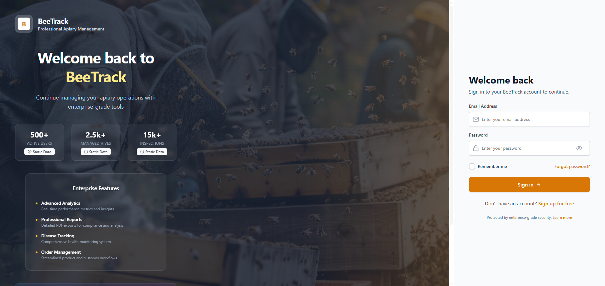
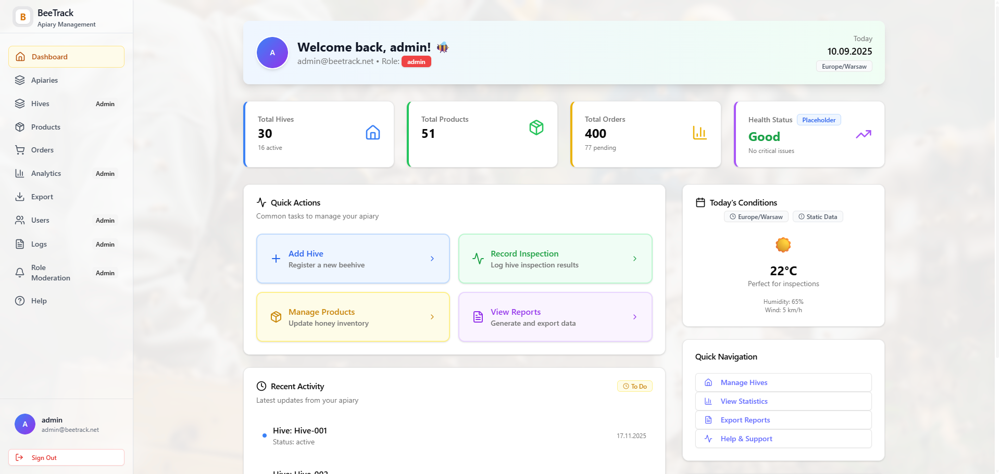
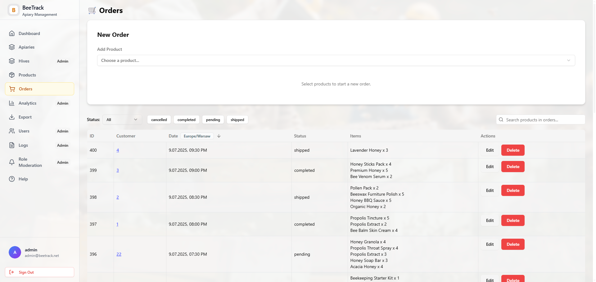
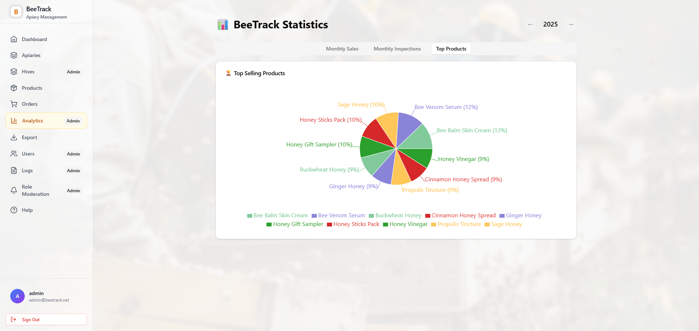

# 🐝 BeeTrack – Comprehensive Apiary Management System

BeeTrack is a full-featured backend & frontend system for managing apiary businesses with advanced collaboration features. Manage hives, inspections, product inventory, orders, user roles, apiaries, and automated background tasks with enterprise-grade security.

Built for real-world use with FastAPI, PostgreSQL, Docker, cron jobs, Alembic, JWT-based authentication, 2FA security, and a modern React + TypeScript + Tailwind CSS frontend.

---

## 🎥 Live Demo

<p align="center">
    
</p>

<p align="center"><em>A publicly hosted live demo environment is planned for a future milestone. Until then, the animated walkthrough above showcases the current UI and core workflows.</em></p>

---

## ✨ Features

### 🔐 **Advanced Authentication & Security**

-   **Multi-factor authentication** – TOTP-based 2FA with QR code setup and recovery codes
-   **Session management** – comprehensive user session tracking and control
-   **Role-based access control** – admin, worker, and user roles with granular permissions
-   **Rate limiting** – API protection against abuse with SlowAPI
-   **User preferences** – customizable themes, timezones, and locales

### 🏢 **Apiary Collaboration System**

-   **Multi-apiary support** – users can own and manage multiple apiaries
-   **Team collaboration** – invite members with different roles (owner, manager, worker)
-   **Invitation system** – secure token-based invitations with email notifications
-   **Role requests** – workers can request role upgrades with admin approval
-   **Ownership transfer** – seamless apiary ownership transitions

### 🐝 **Hive & Inspection Management**

-   **Hive organization** – link hives to specific apiaries with location tracking
-   **Detailed inspections** – temperature, disease detection, comprehensive notes
-   **Inspection history** – complete audit trail of all hive activities
-   **Status tracking** – active/inactive hive monitoring

### 📦 **Product & Order Management**

-   **Inventory control** – product stock management with pricing
-   **Order processing** – complete order lifecycle with status tracking
-   **M:N relationships** – complex order-product associations
-   **Order fulfillment** – track pending, completed, and cancelled orders

### 📊 **Analytics & Reporting**

-   **Comprehensive statistics** – monthly sales, inspection reports, top products
-   **Multi-format exports** – CSV and PDF generation for orders and inspections
-   **Historical analysis** – yearly and monthly trend reporting
-   **Performance metrics** – business intelligence dashboards

### 🗄️ **System Administration**

-   **Advanced logging** – comprehensive audit trails with filtering and search
-   **Automated archival** – scheduled log cleanup and maintenance
-   **Database migrations** – Alembic-powered schema versioning
-   **Seed data management** – automated test data generation
-   **Background tasks** – APScheduler-based cron job management

### 🌍 **Enterprise Features**

-   **Timezone awareness** – UTC backend storage with local timezone display
-   **Internationalization** – multi-language support framework
-   **Avatar management** – user profile customization
-   **Responsive design** – mobile-first modern UI with shadcn/ui components

---

## 🖼️ UI Screenshots

### 🔐 Login



### 📋 Dashboard (admin)



### 📦 Orders view



### 📊 Stats and Reports



---

## 🧰 Tech Stack

| Layer          | Technologies                                      |
| -------------- | ------------------------------------------------- |
| **Language**   | Python 3.11, TypeScript                           |
| **Backend**    | FastAPI, SQLAlchemy, Alembic                      |
| **Frontend**   | React 19, Vite, TypeScript                        |
| **UI**         | Tailwind CSS, shadcn/ui, Radix UI                 |
| **Auth**       | JWT (OAuth2), bcrypt, TOTP 2FA                    |
| **Database**   | PostgreSQL                                        |
| **Cache**      | Redis 7                                           |
| **Security**   | Rate limiting (SlowAPI), CORS, Session management |
| **Scheduling** | APScheduler                                       |
| **Exports**    | pandas, reportlab (PDF generation)                |
| **Charts**     | Recharts                                          |
| **Styling**    | PostCSS, Autoprefixer                             |
| **Icons**      | Lucide React                                      |
| **Container**  | Docker, docker-compose                            |
| **Dev Tools**  | ESLint, TypeScript compiler, Vite dev server      |

---

## 🚀 Getting Started (Development)

### 1. Clone repo and enter project:

```bash
git clone https://github.com/zrdt80/beetrack.git
cd beetrack
```

### 2. Environment files

Create two `.env` files:

#### `.env`

```env
DATABASE_URL=postgresql+psycopg2://beetadmin:securepassword123@db:5432/beetrack
SECRET_KEY=changeme
RATE_LIMIT_STORAGE=redis
REDIS_URL=redis://redis:6379/0
DETAILED_LOGGING_ENABLED=true
PROMETHEUS_ENDPOINT_ENABLED=true
# GENERATE_LARGE_DATA=false
```

#### `.env.db`

```env
POSTGRES_DB=beetrack
POSTGRES_USER=beetadmin
POSTGRES_PASSWORD=securepassword123
```

### 3. Build and run containers

```bash
docker-compose up --build
```

### 4. Access the API and frontend:

-   API Docs: [http://localhost:8000/docs](http://localhost:8000/docs)
-   Frontend: [http://localhost:3000](http://localhost:3000)

---

## 🩺 Health & Readiness

The API exposes endpoints for monitoring and orchestration:

-   `GET /health` – basic liveness check
-   `GET /healthz` – readiness check (used by Docker healthcheck and CI)
-   `GET /health/detailed` – includes DB and Redis connectivity status

Docker healthchecks use `/healthz` and Redis `PING` to determine container health.

---

## 📈 Observability (Prometheus + Grafana)

An optional observability stack is provided via Docker Compose profiles.

Start the core app plus observability:

```bash
docker-compose --profile observability up -d
```

Services:

-   Prometheus: http://localhost:9090 (scrapes `api:8000/metrics` and Redis Exporter)
-   Grafana: http://localhost:3001 (datasource provisioned; dashboard auto-loaded)

Metrics endpoint: `GET /metrics` serves Prometheus TEXT format. Built-in panels include HTTP traffic, latency (P95/P99), 5xx rate, cache hit ratio, DB slow queries, rate limit hits, system CPU, and Redis internals (keys, memory, ops/sec, evictions, keyspace hit ratio).

Alerting rules are loaded from `observability/prometheus/alerts/alerts.yml` for API down, high error rate, elevated latency, low cache hit ratio, and Redis memory pressure.

### 5. CORS Configuration

The backend uses a custom CORS middleware (not FastAPI's default) that dynamically allows common local development origins and supports environment-based extension.

Default allowed origins (development):

-   `http://localhost:3000`
-   `http://127.0.0.1:3000`
-   `http://localhost:5173` (Vite default)
-   `http://127.0.0.1:5173`

In production, only the values explicitly listed in `Settings.cors_allowed_origins` (environment variable `CORS_ALLOWED_ORIGINS`) plus any provided via `CORS_EXTRA_ORIGINS` are allowed.

To add additional origins without code changes, set:

```env
CORS_EXTRA_ORIGINS=https://admin.example.com,https://portal.example.com
```

Notes:

-   Wildcards (`*`) are avoided because credentialed requests (cookies / Authorization) require a specific echoed origin.
-   Preflight `OPTIONS` responses include `Access-Control-Allow-Credentials: true` and expose rate limiting headers.
-   If you add a new frontend dev port, add it to `cors_allowed_origins` or export `CORS_EXTRA_ORIGINS`.

After modifying env vars, rebuild or restart the `api` service so the settings cache refreshes.

---

## 🔐 Test Users

| Role   | Username   | Email               | Password  |
| ------ | ---------- | ------------------- | --------- |
| admin  | admin      | admin@beetrack.net  | admin123  |
| worker | worker     | worker@beetrack.net | worker123 |
| worker | john_doe   | john@beetrack.net   | john123   |
| worker | jane_smith | jane@beetrack.net   | jane123   |

---

## 📊 API Endpoints Overview

For the complete and up-to-date specification, use Swagger UI at: http://localhost:8000/docs

### 🔐 Authentication & Users

| Endpoint                  | Description                               |
| ------------------------- | ----------------------------------------- |
| `/users/register`         | User registration with email verification |
| `/users/login`            | Standard login with optional 2FA          |
| `/users/login/2fa-verify` | Two-factor authentication verification    |
| `/users/2fa/setup`        | Enable 2FA with QR code generation        |
| `/users/2fa/disable`      | Disable two-factor authentication         |
| `/users/sessions`         | Manage user sessions                      |
| `/users/profile`          | User profile and preferences              |

### 🏢 Apiary Management

| Endpoint                                  | Description                            |
| ----------------------------------------- | -------------------------------------- |
| `/apiaries/`                              | Create and list user's apiaries        |
| `/apiaries/{id}`                          | Get, update, or delete specific apiary |
| `/apiaries/{id}/members`                  | Manage apiary team members             |
| `/apiaries/{id}/invitations`              | Send and list member invitations       |
| `/apiaries/{id}/transfer-ownership`       | Transfer apiary ownership              |
| `/apiaries/{id}/hives`                    | Manage hives within specific apiary    |
| `/apiaries/invitations/accept/{t}`        | Accept invitation by token             |
| `/apiaries/invitations/decline/{t}`       | Decline invitation by token            |
| `/apiaries/{id}/invitations/{inv}/cancel` | Cancel pending invitation              |

### 🐝 Hive & Inspection Management

| Endpoint                      | Description                                |
| ----------------------------- | ------------------------------------------ |
| `/hives/`                     | Create and list hives                      |
| `/hives/{id}`                 | Get, update, or delete specific hive       |
| `/inspections/`               | Create and list inspections                |
| `/inspections/hive/{hive_id}` | List inspections for a hive                |
| `/inspections/{id}`           | Get, update, or delete specific inspection |

### 📦 Products & Orders

| Endpoint       | Description                   |
| -------------- | ----------------------------- |
| `/products/`   | Product inventory management  |
| `/orders/`     | Order creation and management |
| `/orders/all`  | List all orders (admin)       |
| `/orders/{id}` | Specific order operations     |

### 📊 Statistics & Reports

| Endpoint                                       | Description                                     |
| ---------------------------------------------- | ----------------------------------------------- |
| `/stats/first-year`                            | Returns the year of the earliest recorded order |
| `/stats/monthly-sales?year=2025&month=7`       | Number of orders and total sales for a month    |
| `/stats/monthly-inspections?year=2025&month=7` | Number of inspections conducted in a month      |
| `/stats/yearly-top-products?year=2025&limit=5` | Top-selling products in a specific year         |
| `/stats/top-products?limit=5`                  | Top-selling products overall                    |

### 📁 Data Export

| Endpoint                       | Description                          |
| ------------------------------ | ------------------------------------ |
| `/export/orders/csv`           | Download all order data as CSV       |
| `/export/orders/pdf`           | Download all order data as PDF       |
| `/export/inspections/pdf`      | Export inspection summaries as a PDF |
| `/export/filtered/orders`      | Export filtered orders (POST)        |
| `/export/filtered/inspections` | Export filtered inspections (POST)   |
| `/export/filtered/hives`       | Export filtered hives (POST)         |
| `/export/filtered/apiaries`    | Export filtered apiaries (POST)      |

### 🗄️ System Administration

| Endpoint          | Description                            |
| ----------------- | -------------------------------------- |
| `/logs/`          | Retrieve all system logs (admin only)  |
| `/logs/clear`     | Clear all logs (admin only)            |
| `/logs/{id}`      | Delete specific log entry (admin only) |
| `/logs/stats`     | Get aggregated log statistics          |
| `/role-requests/` | Manage role change requests            |

---

## 🔐 Authentication & Security Features

### 🛡️ Multi-Factor Authentication (2FA)

BeeTrack includes enterprise-grade two-factor authentication:

-   **TOTP Support** – Compatible with Google Authenticator, Authy, and other TOTP apps
-   **QR Code Setup** – Easy 2FA enrollment with automatic QR code generation
-   **Recovery Codes** – Backup authentication codes for account recovery
-   **Session Management** – Comprehensive tracking of user sessions across devices
-   **Device Information** – Track login locations, devices, and user agents

### 🔑 Session Management

-   **Persistent Sessions** – "Remember me" functionality with secure refresh tokens
-   **Session Revocation** – Users and admins can revoke specific sessions
-   **Activity Tracking** – Monitor last activity and session duration
-   **Security Controls** – Automatic session expiration and security validations

### 👥 Role-Based Access Control

-   **Granular Permissions** – Different access levels for admin, worker, and user roles
-   **Role Upgrade Requests** – Workers can request role promotions with admin approval
-   **Dynamic Authorization** – Context-aware permissions based on apiary membership

---

## 🏢 Apiary Collaboration System

### 🤝 Team Management

BeeTrack supports collaborative apiary management with advanced team features:

### 👥 Member Roles

-   **Owner** – Full control over apiary, can manage all aspects and transfer ownership
-   **Manager** – Can manage members, hives, and invite workers (but not other managers)
-   **Worker** – Can view and update hive inspections, limited management access

### 📧 Invitation System

-   **Email-based Invitations** – Secure token-based invitation system
-   **Role Assignment** – Invite members with specific roles
-   **Invitation Management** – Track pending, accepted, declined, and canceled invitations
-   **Email Validation** – Only registered users can be invited to apiaries

### 🔄 Ownership Transfer

-   **Seamless Transitions** – Transfer apiary ownership to existing members
-   **Role Preservation** – Maintain team structure during ownership changes
-   **Admin Override** – Administrators can facilitate ownership transfers when needed

---

## 📝 Enhanced Logging & Audit System

BeeTrack includes a comprehensive logging system for audit trails and system monitoring:

### 🔍 Enhanced Features

-   **Multi-level Logging** – Support for different log levels (info, warning, error, debug)
-   **Admin-only Access** – Secure log management restricted to admin users
-   **Comprehensive Tracking** – Logs all user actions across the system
-   **Advanced Filtering** – Search by event type, date range, log level, and keywords
-   **Statistics Dashboard** – Visual overview of system activity and trends
-   **Bulk Operations** – Clear all logs or delete individual entries
-   **Automated Archival** – Scheduled cleanup of old logs (configurable retention)
-   **Timezone-aware** – UTC storage with automatic local timezone conversion

### 📊 Extended Log Categories

-   🔐 **Authentication** – Login attempts, 2FA operations, session management
-   👥 **User Management** – User creation, updates, role changes, profile modifications
-   🏢 **Apiary Operations** – Apiary creation, member management, ownership transfers
-   🐝 **Hive Management** – Hive creation, updates, inspections, status changes
-   📦 **Order Processing** – Order creation, updates, status changes, fulfillment
-   🍯 **Product Management** – Inventory updates, product changes, stock modifications
-   📊 **Statistics** – Report generation, data exports, analytics access
-   🔔 **System Events** – Background task execution, scheduled operations
-   ⚠️ **Security Events** – Failed login attempts, suspicious activities, rate limiting

### ⏰ Timezone Handling

-   **Backend**: All timestamps stored in UTC for consistency
-   **Frontend**: Automatic conversion to user's local timezone
-   **Docker**: Containers configured with UTC timezone (`TZ=UTC`)
-   **Display**: Smart formatting with relative time ("2 hours ago") and full timestamps
-   **User Preferences**: Individual timezone settings per user account

---

## 👤 User Management & Preferences

### 🎨 Personalization Features

-   **Avatar Support** – Upload and manage user profile pictures
-   **Theme System** – Dark, light, and system-based theme preferences
-   **Timezone Configuration** – Individual timezone settings for accurate datetime display
-   **Locale Support** – Multi-language support framework (currently English)
-   **Profile Management** – Comprehensive user profile editing

### 🔄 Role Request System

-   **Worker Promotion** – Users can request worker role upgrades
-   **Admin Approval** – Role changes require administrator approval
-   **Request Tracking** – Monitor pending, approved, and rejected requests
-   **Rejection Templates** – Standardized rejection reasons for consistency
-   **Request History** – Complete audit trail of role change requests

---

## 📁 Enhanced Seed Data

The backend seeds realistic demo data from [`app/services/seed_data.json`](app/services/seed_data.json).

### 👥 Users & Roles

-   Admins: `admin`, `manager`, `owner`
-   Workers: `worker`, `qa`, `operator1`, `operator2`, `fieldtech`, `beekeeper1`, `beekeeper2`, `beekeeper3`
-   Standard users: `analyst`, `john`, `auditor`, `researcher`, `biologist`, `logistics`, `sales1`, `sales2`, `support1`, `support2`, `guest`
-   Passwords match the JSON (e.g., `admin123`, `worker123`, etc.). 2FA is disabled by default; you can enable it after login.

### 🏢 Apiaries & Memberships

Ten apiaries are created:

-   Apiary Alpha (owner: `owner`)
-   Apiary Beta (owner: `manager`)
-   Apiaries Gamma, Delta, Epsilon, Zeta, Eta, Theta, Iota, Kappa (owner: `worker`)

Example team memberships:

-   Alpha: `worker` (manager), `qa` (worker)
-   Beta: `operator1` (worker), `operator2` (worker)
-   Gamma: `beekeeper1` (manager), `beekeeper2` (worker)
-   Delta: `beekeeper3` (worker)
-   Epsilon: `fieldtech` (worker)

### 🍯 Products & Inventory

Rich catalog with 40+ items, including honey varietals (Acacia, Buckwheat, Wildflower, Manuka), spreads, cosmetics (lip balm, face mask), propolis, royal jelly, beeswax goods, samplers, and even a starter kit. Each product includes name, description, unit price, and stock quantity.

### 🐝 Hives

30 hives (`Hive-001` … `Hive-030`) distributed across the apiaries with status values like `active` and `maintenance`, and realistic `last_inspection_date` timestamps.

### 🔍 Inspections

20 inspection records are provided as examples: 10 for `Hive-001` and 10 for `Hive-002`, with temperature readings and sample disease flags such as `varroa`, `nosema`, and `foulbrood`.

### 🧾 Orders

No orders are pre-seeded. Create orders via the UI or API to test exports and statistics.

---

## 🐳 Docker Notes

### 🧱 Backend (FastAPI)

-   `entrypoint.sh` runs:

    1. Alembic migrations
    2. Seed data if the database is empty
    3. Uvicorn server (`uvicorn app.main:app`)

-   `logs/` and `exports/` directories are mounted into the container and excluded from the Docker image via `.dockerignore`.

-   Backend is available by default at: `http://localhost:8000`

---

### 🧑‍💻 Frontend (React + TypeScript + Vite)

-   **Modern Stack** – React 19 with TypeScript for type safety
-   **Fast Development** – Vite for lightning-fast HMR and building
-   **UI Components** – shadcn/ui with Radix UI primitives for accessibility
-   **Styling** – Tailwind CSS with custom design system
-   **State Management** – React hooks and context for efficient state handling
-   **Routing** – React Router with protected routes and navigation guards
-   **Charts & Analytics** – Recharts for data visualization
-   **Icons** – Lucide React icon library
-   **Forms** – Advanced form handling with validation
-   **Responsive Design** – Mobile-first approach with responsive layouts
-   **Build Optimization** – Production builds served by Nginx
-   **Development Tools** – ESLint, TypeScript compiler, and modern tooling

-   The frontend is built and served by **Nginx** in a separate container.
-   Default URL: `http://localhost:3000`
-   React Router-based routing is handled by `nginx.conf` using `try_files $uri /index.html`.
-   The environment variable `VITE_API_URL` should point to the backend address, e.g., `http://localhost:8000`.

---

### 🧪 Running the full environment

```bash
docker-compose up --build -d
```

After launch:

-   Frontend: [http://localhost:3000](http://localhost:3000)
-   Backend docs: [http://localhost:8000/docs](http://localhost:8000/docs)

You can also check readiness at: [http://localhost:8000/healthz](http://localhost:8000/healthz)

---

### ⚠️ Notes

-   The frontend container depends on the backend (`depends_on: api`), but make sure that `VITE_API_URL` points to the correct backend address during build.
-   In production, it's recommended to expose both services via a reverse proxy (e.g., Traefik, Nginx, Caddy) or unify them under a single domain.

---

## 📌 Development Roadmap

### ✅ Completed Features

-   [x] **Core API** – REST API with comprehensive role-based access control
-   [x] **Database Relations** – Complex order-inspection-product relationships
-   [x] **Background Tasks** – Cron jobs and automated background processing
-   [x] **Export System** – PDF & CSV export functionality
-   [x] **Modern Frontend** – React with TypeScript, Tailwind, and component library
-   [x] **User Management** – Soft delete and comprehensive user administration
-   [x] **Security** – Rate limiting for key endpoints and API protection
-   [x] **Audit System** – Comprehensive admin logging with filtering and search
-   [x] **Timezone Support** – Full timezone-aware datetime handling
-   [x] **Analytics** – Advanced log filtering and statistical reporting
-   [x] **Authentication** – Multi-factor authentication with TOTP and recovery codes
-   [x] **Session Management** – Comprehensive user session tracking and control
-   [x] **User Preferences** – Avatar, themes, timezone, and locale customization
-   [x] **Apiary System** – Multi-apiary support with team collaboration
-   [x] **Team Features** – Member invitations, role management, and ownership transfer
-   [x] **Role Requests** – Worker promotion system with admin approval
-   [x] **Data Validation** – Comprehensive input validation and error handling

### 🚧 In Progress & Planned

-   [ ] **Testing Suite** – Comprehensive unit tests (pytest + vitest)
-   [ ] **API Documentation** – Enhanced OpenAPI documentation with examples
-   [ ] **Admin CLI** – Command-line tools for system administration
-   [ ] **Email Notifications** – Email alerts for invitations, role changes, and system events
-   [ ] **Cloud Deployment** – Production deployment guides for Render/Fly.io/AWS
-   [ ] **Mobile App** – React Native mobile application
-   [ ] **Advanced Analytics** – Business intelligence dashboard with KPIs
-   [ ] **Backup System** – Automated database backup and recovery procedures
-   [ ] **Monitoring** – Application performance monitoring and alerting
-   [ ] **Webhooks** – External system integration via webhooks
-   [ ] **Multi-language** – Full internationalization support
-   [ ] **Advanced Security** – Additional security features and compliance tools
-   [ ] **Responsive UI Enhancements** – Continued refinement of mobile and tablet breakpoints, performance optimizations for low-bandwidth devices, and accessibility improvements (WCAG alignment)

---

## 📄 License

MIT License – Feel free to use, modify, and distribute for learning, commercial, or non-commercial projects.

---

**Made with Tea 🍵, Python, and TypeScript**
